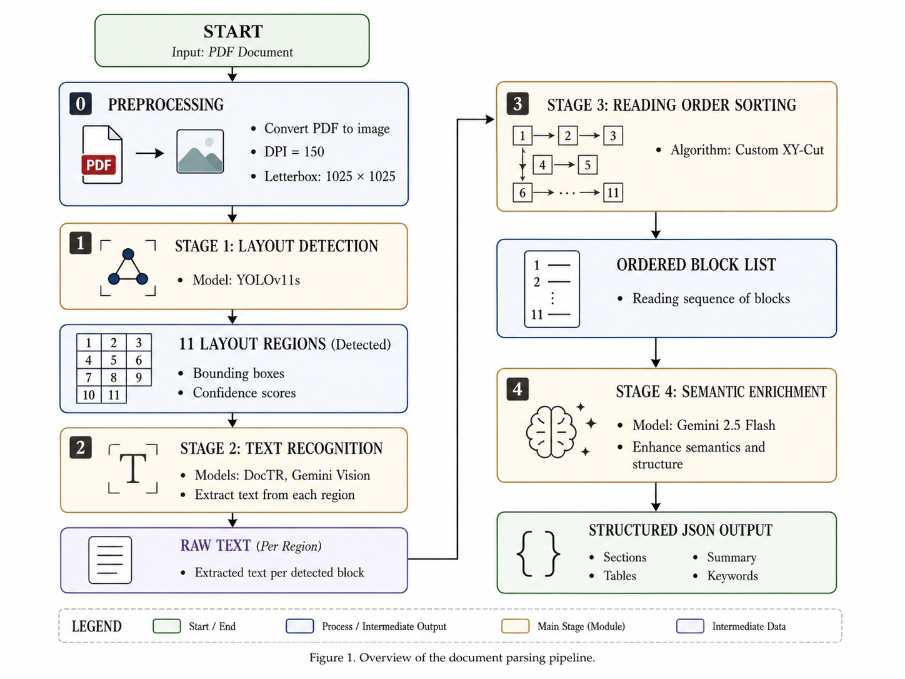
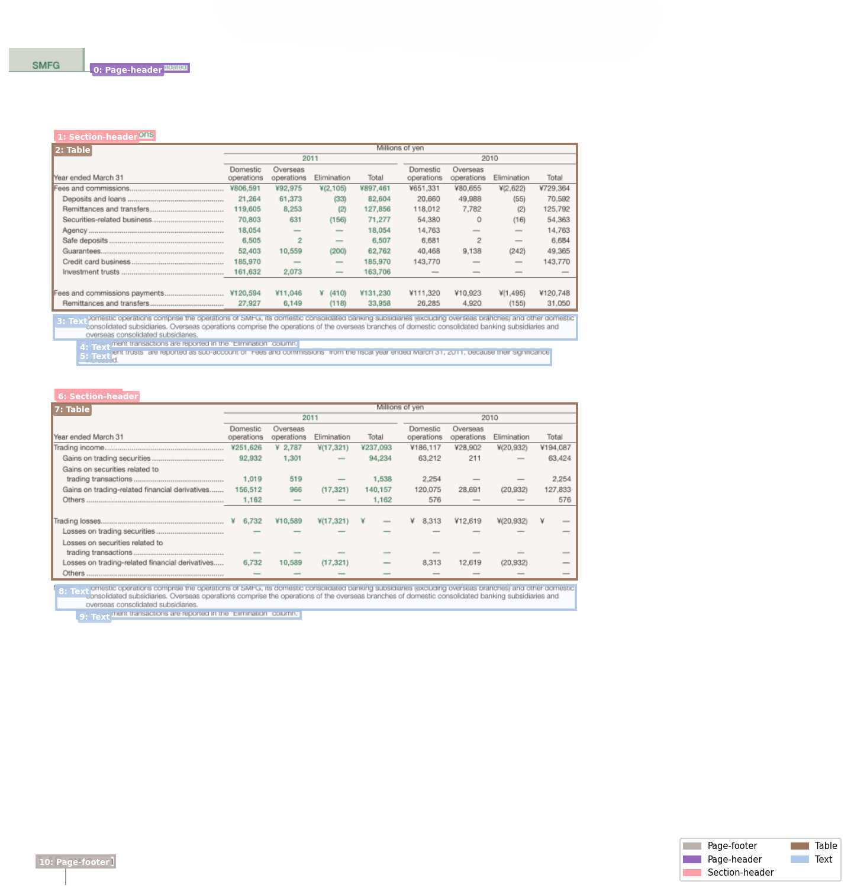
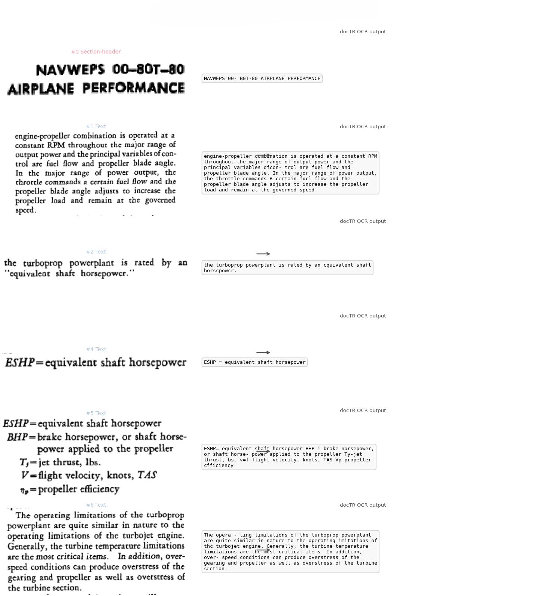
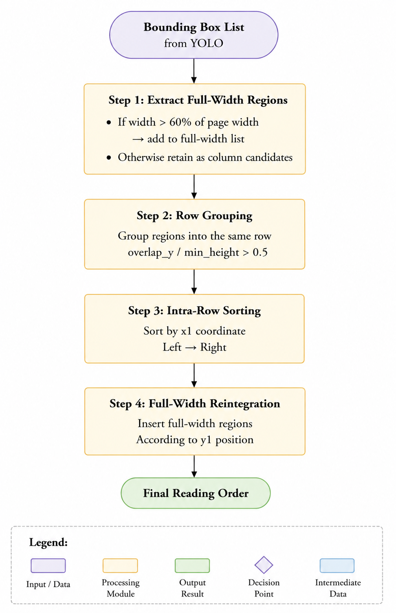
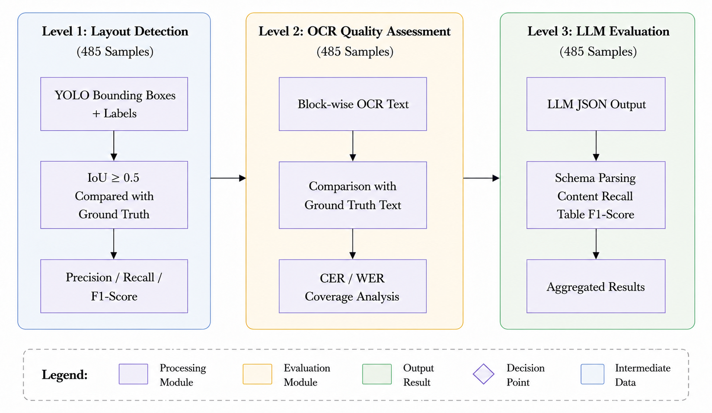
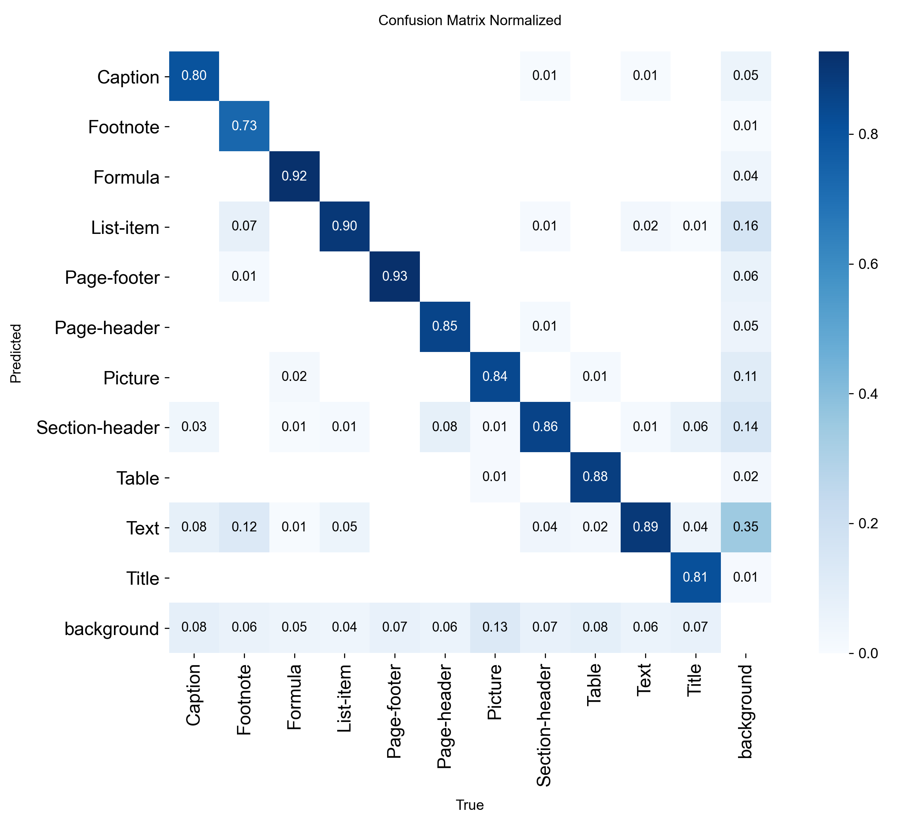
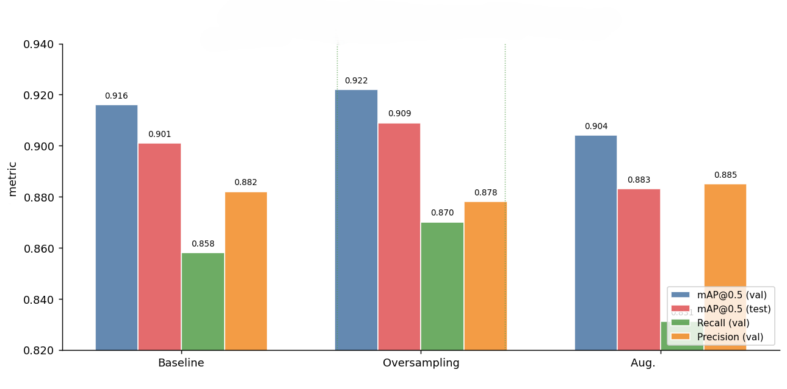

# Document Layout Analysis Pipeline

**Deep Learning-Based PDF Document Layout Analysis**

> Bachelor's Thesis — LÊ TIẾN THẮNG (22200144)  
> Supervisor: M.Sc. Nguyen Quoc Khoa  
> University of Science, VNU-HCM — Faculty of Electronics & Telecommunications  
> Academic Year 2025–2026


---

## Abstract

This thesis presents an end-to-end pipeline for document layout analysis and semantic structure extraction from PDF documents. The pipeline combines four stages: **(1)** YOLOv11s for detecting 11 layout block classes, **(2)** docTR for crop-level OCR, **(3)** a custom XY-Cut algorithm for reading order assignment, and **(4)** Gemini 2.5 Flash for structured JSON extraction. Trained and evaluated on DocLayNet (485 samples), the system achieves mAP@0.5 = 0.909 on object detection, schema parse rate = 99.8%, and operates at ~$0.0035/page — 3–18× cheaper than commercial alternatives (Adobe PDF Extract, AWS Textract, Google Document AI).

---

## Pipeline Overview



The pipeline processes a PDF page through four sequential stages:

| Stage | Module | Key metric |
|-------|--------|------------|
| 1. Layout Detection | YOLOv11s (11 classes) | mAP@0.5 = **0.909** |
| 2. OCR | docTR (crop-level) | CER text/list = **~0.12** |
| 3. Reading Order | Custom XY-Cut | <1 ms/page |
| 4. Semantic Enrichment | Gemini 2.5 Flash | Schema parse rate = **99.8%** |

---

## Key Results

### End-to-end Evaluation (485 samples, DocLayNet test set)

| Module | Metric | Value |
|--------|--------|-------|
| YOLO detection | mAP@0.5 (test) | **0.909** |
| YOLO detection | Table detection rate | **94.5%** |
| YOLO detection | End-to-end F1 (mean) | **0.804** |
| docTR OCR | CER — Text / List-item | **~0.12** |
| LLM stage | Schema parse rate | **99.8%** |
| LLM stage | Content recall† | **0.800** |
| LLM stage | Table token F1† | **0.870** |
| Performance | Total latency (mean) | **~8,000 ms/page** |
| Cost | Gemini API (mean) | **~$0.0035/page** |

*† Upper-bound estimate — GT has circular dependency with Gemini 2.5 Flash (see [docs/thesis.md §4.1.2](docs/thesis.md))*

### Baseline Comparison (100 samples, independent benchmark)

| Method | Valid samples | Content Recall | Table Token F1 |
|--------|--------------|----------------|----------------|
| **Pipeline (proposed)** | 99/100 | **0.986** | 0.939 |
| PyMuPDF / pdfplumber | 100/100 | 0.995 | 0.630 |
| docTR full-page OCR | 100/100 | 0.994 | 0.643 |
| Gemini Vision full-page | 89/100 | 0.992 | 0.981† |

*† Gemini Vision Table F1 likely inflated by same-model circular bias; 11% API fail rate in production*

The pipeline is the **only method achieving simultaneously** content recall ≥ 0.986 and table F1 ≥ 0.939 with fail rate ≤ 1%.

### Cost Analysis

| Solution | Cost/page | vs. Pipeline |
|----------|-----------|-------------|
| **Pipeline (proposed)** | **~$0.0035** | baseline |
| Adobe PDF Extract API | $0.015 | ~4× more expensive |
| AWS Textract (forms) | $0.065 | ~18× more expensive |
| Google Document AI | $0.030 | ~8× more expensive |
| Azure Form Recognizer | $0.010 | ~3× more expensive |

---

## Figures

<table>
<tr>
<td align="center"><br><sub>YOLO layout detection</sub></td>
<td align="center"><br><sub>Crop-level OCR output</sub></td>
</tr>
<tr>
<td align="center"><br><sub>XY-Cut reading order</sub></td>
<td align="center"><br><sub>3-level evaluation framework</sub></td>
</tr>
<tr>
<td align="center"><br><sub>YOLO confusion matrix</sub></td>
<td align="center"><br><sub>Ablation study results</sub></td>
</tr>
</table>

---

## Project Structure

```
github_showcase/
├── README.md
├── requirements.txt
├── src/
│   ├── pipeline.py              # Core pipeline: YOLO + docTR + XY-Cut + Gemini
│   ├── baseline_comparison.py   # 4-method baseline benchmark (100 samples)
│   ├── demo_app.py              # Streamlit interactive demo
│   ├── eval_pipeline.py         # Block detection & OCR evaluation
│   ├── eval_llm.py              # LLM stage evaluation
│   ├── train.py                 # YOLOv11s training on DocLayNet
│   └── generate_figures.py      # Thesis figure generation
├── results/
│   ├── baseline_comparison_table.txt   # Main comparison table
│   ├── baseline_summary.json           # Cost analysis & aggregate stats
│   ├── baseline_per_sample.csv         # Per-sample baseline results (100 samples)
│   ├── eval_per_sample.csv             # Block detection results (485 samples)
│   └── eval_per_sample_llm.csv         # LLM stage results (485 samples)
├── figures/                     # 14 key visualizations
├── notebooks/
│   ├── pipeline_demo.ipynb      # Interactive pipeline walkthrough
│   └── training_walkthrough.ipynb  # Training experiment notebook
├── docs/
│   ├── thesis.md                # Full thesis (~140KB)
│   └── llm_analysis.md          # In-depth LLM limitations analysis
└── samples/
    ├── sample1.pdf              # Test PDF (digital, English)
    └── sample2.pdf              # Test PDF (mixed content)
```

---

## Installation

### Prerequisites

**1. Python 3.11**

```bash
pip install -r requirements.txt
```

**2. Poppler** (for PDF → image conversion)

- Windows: download from [oschwartz10612/poppler-windows](https://github.com/oschwartz10612/poppler-windows/releases/), extract to `poppler/Library/bin/` in project root
- Linux: `sudo apt-get install poppler-utils`
- macOS: `brew install poppler`

**3. YOLO weights**

Download `best.pt` from the [Releases](../../releases) page and place at `dataset/BaseC/best.pt`.

**4. Gemini API key**

```bash
export GEMINI_API_KEY="your_key_here"
```

Or set directly in `src/pipeline.py`.

---

## Usage

### Interactive Demo (Streamlit)

```bash
streamlit run src/demo_app.py
```

Open browser at `http://localhost:8501`, upload a PDF, and click **Run Pipeline**.

### Benchmark Latency & Cost

```bash
python src/pipeline.py --limit 50 --seed 42 --save-outputs 5
```

Output: `benchmark_results/benchmark_summary.json`, `benchmark_results/benchmark_per_sample.csv`

### Baseline Comparison (4 methods)

```bash
python src/baseline_comparison.py --n 100
```

Runs PyMuPDF, docTR full-page, Gemini Vision, and the proposed pipeline. Saves results to `baseline_results/`.

### Full Evaluation

```bash
python src/eval_pipeline.py   # Block detection + OCR (CER)
python src/eval_llm.py        # LLM stage (content recall, table F1)
```

---

## Dataset

[DocLayNet](https://github.com/DS4SD/DocLayNet) — 80,863 annotated pages across 11 layout classes (Text, Title, List-item, Table, Figure, Caption, Formula, Footnote, Page-header, Page-footer, Section-header). We use the pre-split test set (485 samples) for evaluation.

**11 Layout Classes:**

| Class | Frequency | Difficulty |
|-------|-----------|------------|
| Text | 45.82% | Easy |
| List-item | 23.14% | Easy |
| Section-header | 9.67% | Medium |
| Figure | 6.31% | Medium |
| Table | 5.63% | Hard (structure) |
| Caption | 3.42% | Hard (tiny) |
| Formula | 2.41% | Hard |
| Page-header | 1.73% | Medium |
| Footnote | 0.60% | Hard (tiny) |
| Page-footer | 1.30% | Hard |
| Title | 0.47% | Hard (rare) |

---

## Technical Highlights

**Layout Detection (YOLO):**
- YOLOv11s (9.4M params) with oversampling strategy to address 97:1 class imbalance
- All 11 classes achieve AP > 0.83; ablation study shows oversampling > strong augmentation for document data
- Training: Kaggle T4 GPU, batch=24, 50 epochs, ~8.5 hours

**OCR (docTR):**
- Crop-level inference — each detected block OCR'd independently
- Routing strategy: Table blocks → TATR cell detection; others → docTR
- CER ~0.12 on body text; page-header/footer CER high due to small font and layout diversity

**Reading Order (XY-Cut):**
- Custom two-stage algorithm: mid-point ratio for column split + vertical overlap for row grouping
- O(n log n), <1 ms/page, no segmentation mask required
- Reference: Pavlidis & Zhou (CVGIP, 1992) [12]

**LLM Enrichment (Gemini):**
- Thinking mode disabled → cost 4.7× lower with no schema parse rate loss
- Input: OCR text with reading order tags → Output: structured JSON (sections, paragraphs, tables, footnotes)
- Verbatim constraint in prompt ensures content fidelity

---

## Citation

```bibtex
@thesis{le2026dla,
  title     = {Deep Learning-Based PDF Document Layout Analysis},
  author    = {Le Tien Thang},
  school    = {University of Science, VNU-HCM},
  year      = {2026},
  type      = {Bachelor's Thesis},
  note      = {Supervisor: Nguyen Quoc Khoa, M.Sc.}
}
```

---

## License

MIT License — see [LICENSE](LICENSE) for details.

*This project is for academic purposes. Commercial use of Gemini API is subject to Google's terms of service.*
